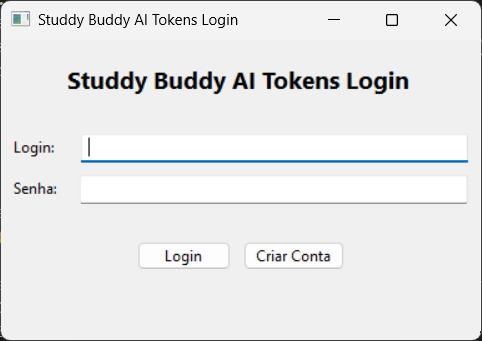
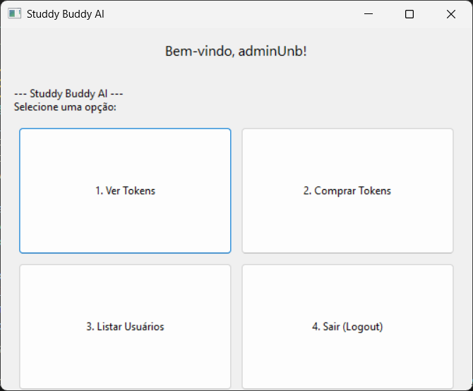

# Studdy Buddy AI - Compra de Tokens

## Estrutura da Aplicação

- `package/aplicacao_gui.py`: Lógica principal da aplicação, interface do usuário, fluxo de login e operações.
- `package/contaUsuario.py`: Classe de usuários comuns.
- `package/admin.py`: Classe de administradores (herda de contaUsuario).
- `package/bancoDados.py`: Gerenciamento de persistência dos dados dos usuários e administradores em arquivos JSON.
- `main_gui.py`: Script de inicialização para testes.

---

## Exemplo de Uso

Ao rodar o `main_gui.py`, a aplicação será iniciada. O usuário será guiado por menus intuitivos usando a interface gráfica wxPython, que adapta ao OS usado pelo usuário:

---

## Observações antes do uso

- Lembre-se de fazer `pip install wxpython`, senão o arquivo não rodará
- Rode apenas o arquivo `main_gui.py`

---

## Contribuição

Sinta-se livre para abrir issues ou pull requests para sugerir melhorias, relatar bugs ou contribuir para o crescimento do projeto.
